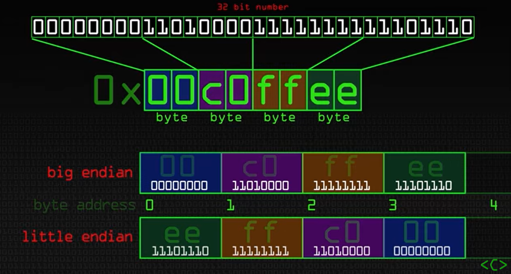

__Tema for uken:__ innføring i sockets, forbindelsesløs kommunikasjon med UDP-sockets, localhost, klienter og servere

Utrolig god ressurs for å forstå nettverksprogrammering bedre:
https://beej.us/guide/bgnet/html/

__Oppdatering:__
Noen nyttige mansider:
man 7 ip
man inet_pton

## Socketprogrammering

__Sockets__ er kommunikasjonsgrensesnitt som programmer bruker for å sende og motta data over nettverket. De fungerer som en endpoint for nettverkskommunikasjon mellom to enheter. I koden opprettes sockets ved hjelp av socket()-funksjonen, som returnerer en socket-fildeskriptor som brukes til å referere til socket i videre operasjoner.

I "simple terms" kan du tenke på en socket som en slags postkasse. Den lytter og sier ifra når den får noe.

__UDP__ (User Datagram Protocol) er et forbindelsesløst protokoll som ikke krever en forhåndsetablert forbindelse mellom sender og mottaker. Det betyr at data sendes som enkeltstående pakker, kalt datagrammer, uten at det er garantert at de når frem eller kommer i riktig rekkefølge. I koden er UDP-sockets opprettet ved å bruke SOCK_DGRAM som det andre argumentet til socket()-funksjonen.

| **UDP**               | **TCP**            |
|-----------------------|--------------------|
| NO error recovery     | Error recovery     |
| NO reliability        | Reliability        |
| NO flow control       | Flow control       |
| NO congestion control | Congestion control |
| SOCK_DGRAM            | SOCK_STREAM        |

__Klienter og servere:__ I nettverkskommunikasjon representerer en klient en enhet som sender forespørsler til en annen enhet, kalt serveren, som igjen behandler forespørselen og sender tilbake et svar.

__htons()__ og __ntohs()__: Forskjellige operativsystemer bruker forskjellige byte rekkefølger for multibyte integers (altså alt som er større enn en char). For samme tall kan en maskin tro at det er en 1'er, og en annen tro at det er 256. Dette handler om endianness. Når vi skal bruke porter er det lurt å bruke htons når vi skal sende noe. ntohs kan brukes når vi har mottatt noe og vil printe ut porten vi mottok på for eksempel.

__bind():__ Bind-funksjonen brukes på server-siden for å knytte en socket til en bestemt lokal IP-adresse og portnummer. Dette gjør at serveren kan lytte etter innkommende meldinger på den angitte porten.

__sendto()__ og __recvfrom()__: Disse funksjonene brukes i forbindelsesløs kommunikasjon for å sende og motta data gjennom UDP-sockets. sendto() brukes av klienten for å sende en melding til serveren, og av serveren for å sende den en melding tilbake til klienten. recvfrom() brukes av serveren for å motta meldinger fra klienten, og av klienten for å motta meldingen fra serveren.

## Byte order
Tenk på hvordan du skreller ett egg: begynner du fra den store enden eller den lille enden? De som følger little endian ville begynt på den spisse, mindre enden, mens de som følger big endian ville begynt på den flatere, større enden.

Big endian = most significant byte first \
Little endian = least significant byte first

Video om dette: https://youtu.be/NcaiHcBvDR4

## Localhost
IP 127.0.0.1 \
Du trenger ikke å ha to PC'er for å kjøre både klient og server - du kan bruke din egen PC til begge disse tingene.

Se IP-addresse på din egen maskin: \
`ifconfig` \
`ip addr` \
`hostname -I`
