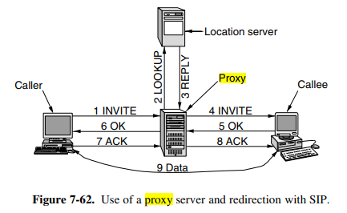

# Select

__Tema for uken:__ hendelsesløkker med select

Ukens tema bygger på UDP og TCP. Hvordan kan vi lytte til socketen vår og samtidig lytte til tastaturet? Svaret: med select. 

Det går ann å bruke fgets(buffer, size, stdin) for å lese inn brukerinput fra terminalen. Men denne funksjonen blokker. Derfor kan vi ikke recv'e samtidig. På samme måte, la oss si at vi er en server. I tillegg til å lytte etter innkommende forbindelser vil vi fortsette å motta fra de forbindelsene vi allerede har. Men det kan vi ikke gjøre, siden både accept() og recv() blokkerer!

Vi bruker derfor select. Den gjør det mulig for oss å lytte på flere fildeskriptorer samtidig og UTEN å blokke. Select forteller deg hvilke som er klare for å lese, hvilke som er klare for å skrive, hvilke som har kastet en exception osv.

Ofte så vil vi bruke select i en løkke. Ellers så kan vi jo bare gjøre én meldingsutveksling. Da forsvinner kanskje litt av poenget.


__Grov framgangsmåte:__
1. Deklarer et fildeskriptorset (se man select). Gjør det for eksempel samme sted som du deklarerer socketsene dine.
```cpp
fd_set fds;
```

2. Lag hendelsesløkken og legg til fildeskriptorene til fd-settet. \
Tillegg: kan sette en timeout. Denne bestemmer hvor lenge vi skal gidde å vente.
```cpp
while (strcmp(buf, "q")){
    timeout.tv_sec = 5;  // sekunder
    timeout.tv_usec = 0;  // mikrosekunder

    // Clearer alt fra settet slik at fds blir en tom mengde / liste. Må gjøres.
    FD_ZERO(&fds);
    // sett inn fd i fds
    FD_SET(msg_fd, &fds);
    FD_SET(STDIN_FILENO, &fds);
}
```

3. Bruk select for å lytte på alle fildeskriptorene. \
Fra manualen:
```
int select(int nfds, fd_set *readfds, fd_set *writefds,
                  fd_set *exceptfds, struct timeval *timeout);
```

```cpp
while (strcmp(buf, "q")){
    // [...]

    rc = select(FD_SETSIZE, &fds, NULL, NULL, &timeout);
    check_error(rc, "select");  // husk å sjekke returverdier til funksjoner!
}
```
Når select returnerer så vil readfds bli endret slik at den forteller oss hvilken av fildeskriptorene som er klare for lesing. Da kan vi bruke FD_ISSET() for å se hvilken fd som har blitt "aktivert".

4. Bruk FD_ISSET() for å sjekke hvilken fildeskriptor som er klar for lesing.
```cpp
while (strcmp(buf, "q")){
    // [...]

    if (FD_ISSET(msg_fd, &fds)){
        // melding fra msg_fd
        //[...]
    }
    if (FD_ISSET(STDIN_FILENO, &fds)){
        // melding fra stdin / tastaturet
        //[...]
    }
}
```

# Proxyer

En proxy, eller en såkalt proxy server, er noe som tilbyr en sikker forbindelse mellom to maskiner. Den oppfører seg som en intermediary mellom disse to maskinene, og tillater dem å kommunisere uten å ha direkte forbindelse mellom hverandre.



Fra s. 733 i nettverksboken.


## Tips til hjemmeeksamen
- Kjør valgrind ofte. Dette kan spare deg for MASSE tid. Det er mye lettere å oppdage hvor du har introdusert feil.
- Legg en plan før du begynner
- Spør gruppelærere, Magnus eller Carsten. Spesielt hvis dere lurer på hva oppgaven spør om, så spør Carsten. Han kan hjelpe dere med oppgaveforståelse.
- Husk å sjekke returverdiene til funksjonene dere bruker. Man kan for eksempel lage en funksjon check_error() eller liknende.