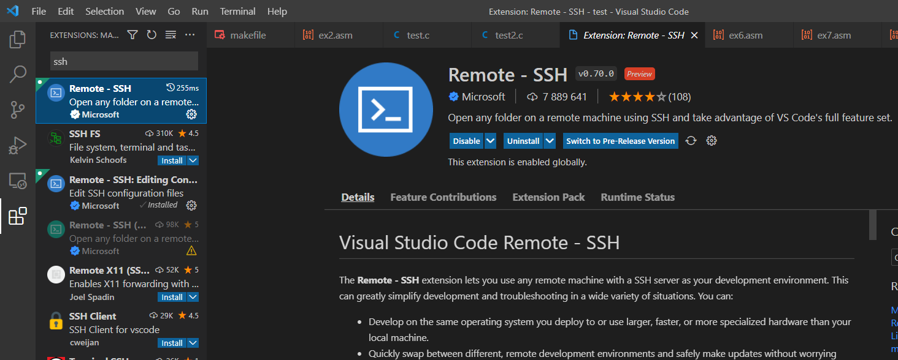
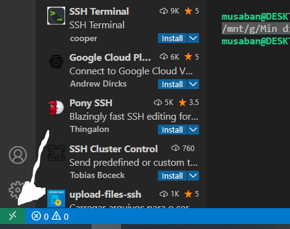
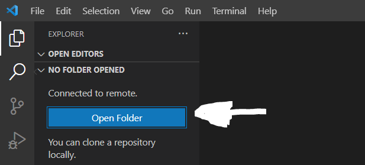

# Uke 3

[test.c filen fra gruppetimen er her](./test.c)

[Tilbake til oversikt](../README.md)

[Veldig god guide fra ifjor](https://github.uio.no/IN2140v2/in2140-v22/tree/gh-pages/c-programmering/komme-i-gang)

<details>
<summary> SSH SCP </summary>

**innlogging**

```bash
ssh <brukernavn>@login.ifi.uio.no
```

**lage en mappe for in2140 i SSH**

```bash
mkdir in2140-v22
```

```bash
cd in2140-v22
```

```bash
mkdir ukesoppgaver
```

```bash
mkdir obliger
```

**overføre en fil**

```bash
scp -r hoho.txt <brukernavn>@login.ifi.uio.no:~/gruppelaerer/testern
```

**overføre alt innholdet i mappen du befinner deg i**

```bash
scp -r * <brukernavn>@login.ifi.uio.no:~/gruppelaerer/testern
```

**overføre en mappe**

```bash
scp -r ./gruppelaerer <brukernavn>@login.ifi.uio.no:<dest>
```

**slette en fil**

```bash
rm -r "hoho.txt"
```

**slette alt innholdet i en mappe**

```bash
rm -r *
```

**slette en mappe**

```bash
rm -r <mappenavn>
```

**relativ mappe**
NB: merk at når det er mellomrom i en filbane så kan du legge til fnutter "he he", så det fortsatt tolkes som ett argument
Ett argument:

```bash
"./ett argument"
```

To argument:

```bash
./to argument
```

**compressing**

```bash
tar -czf <filnavn>.tar.gz ./<mappenavn>
```

**extracting**

```bash
tar -xzf <filnavn>.tar.gz
```

[view.uio.no](https://view.uio.no/) for en visuell fjerninnlogging

</details>

<details>
<summary>WSL (windows subsystems for linux)</summary>
[Install WSL | Microsoft Docs](https://docs.microsoft.com/en-us/windows/wsl/install)

</details>

<details>
<summary>VS remote</summary>
Omformulert og forkortet fra denne guiden:
[Microsoft SSH-guide](https://code.visualstudio.com/docs/remote/ssh)

#### 1. Verifiser at du kan koble deg til med SSH via terminalen din

```bash
ssh <brukernavn>@login.ifi.uio.no
```

**NB: hvis dette ikke funker har du ikke SSH, så installeres først (se google)**

#### 2. Installer extension i VS-code ved navn SSH-remote



#### 3. Nede til venstre trykker du på følgende symbol



#### 4. Igjen skriv inn følgende

```bash
<brukernavn>@login.ifi.uio.no
```

#### 5. Velg Linux som operativ system

#### 6. Så skal resten ordne seg selv (må skrive inn passord på et tidspunkt)

Herfra er det bare å åpne en mappe som du ville gjort til vanlig.



eller


</details>

<details>
<summary>Helloworld.c</summary>

```c
#include <stdio.h>
int main(void) {

	printf("Hello World!\n");
}
```

</details>

<details>
<summary>Grunnleggende datatyper</summary>

```c
char c;				// 1 byte	range = -128 - 127
short s;			// 2 bytes
int i;				// 4 bytes
long l;				// 8 bytes
// avslutt en long med L
long l = 11122233344L

// unsigned er like mange bytes, men er bare positive tall.
// saa i signed brukes foerste biten til aa si om tallet er positivt
// eller negativt
unsigned char uc; 	// 1 byte	range = 0-255

sizeof(int); // - brukes til å finne stoerrelsen på datatyper

char c = 'c';			// single quotes for character
char *my_string = "Hei!";		// double quotes for string

//10-talls system
char a = 10;
//2-talls system
char b = 0b1010;
//hex system
char c = 0x0A;

printf("a: %d\nb: %d\nc: %d\n", a, b, c);
```

</details>
