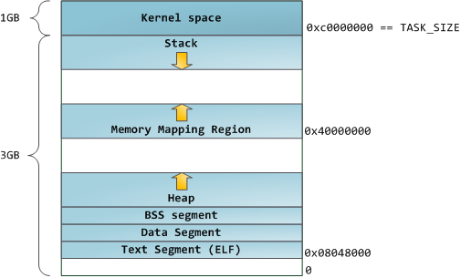

# Minne

Hittil har vi kun sett/skrevet programmer hvor alle størrelsene har vært kjent i _compile-time_ (Kjent før/under kompilering).

Hva gjør vi hvis vi må håndtere ting som ikke er kjent under kompilering. Dette skjer ofte. Noen tilfeller er når vi lager strenger av ukjent størrelse, når vi får data fra en HTTP-Request og generelt sett de fleste operasjoner som skjer mens programmet kjører.

Vi må be om minne fra OS'et.

## Heap og Stack

Når du skriver programmer, så er alle variabelene, funksjons-signaturene, strenger osv lagret på **_stacken_**. Stacken (The Stack)



Minne som programmet ber om, får vi fra **_heap_**

Merk at stacken starter på høye addresser og beveger seg nedover, mens heapen starter på lave, og beveger seg oppover.

Når vi ber OS'et om minne, så får vi en blokk fra heapen. Typisk får vi mer enn det vi spør om. Spør vi om 8 bytes, kan det hende at vi får 1024 bytes, men dere må forholde dere til at dere KUN fikk 8 bytes. I det tilfelle du faktisk får nøyaktig det du spør om.

Minne som blir gitt, må "frigjøres". Dette lærer dere under.

## Programmering

Hvordan gjør vi dette i praksis?

Vi har de følgene funksjonene som er sentrale. De finnes i `stdlib.h` og er `malloc`, `calloc`, `realloc` og `free`

```cpp
#include <stdlib.h>
#include <stdio.h>

void some_function(int *myArray) {
    myArray = malloc(15 * sizeof(int));

    if (myArray == NULL) {
        fprintf(stderr, "Noe gikk galt\n");
        exit(EXIT_FAILURE);
    }
}

int main(void) {

    srand(10);
    int* myArray = malloc(10 * sizeof(int));

    if (myArray == NULL) {
        fprintf(stderr, "Noe gikk galt");
        return EXIT_FAILURE;
    }

    int* myArray2;

    some_function(myArray2);

    for(int i=0; i<10; i++) {
        myArray[i] = rand() % 20;
    }

    free(myArray);
    return EXIT_SUCCESS;
}
```

I det lille programmet over, gjør vi følgene. Vi ber malloc om å gi oss en _peker_ til en addresse, hvor vi har plass til 10\*sizeof(int) bytes. Vi skriver så til disse plassene, og tilslutt når vi er ferdige med plassene, frigjør vi pekeren med `free()`. Vi må alltid kalle `free()` når vi er ferdige med minne som vi får av `malloc`, `calloc` og `realloc`

Du kan bruke verktøyet "Valgrind" for å sjekke for minne-feil. Disse oppstår når du f.eks skriver utenfor en peker som du har fått av `malloc` og `calloc` eller glemmer å frigjøre minne som du får. Programmet "Memory" har både minne-feil, og riktig bruk av malloc.

Bruk valgrind til å finne feilene, og bli kjent med valgrind sin output. Prøv å forstå hvilken feil som gir hvilken feilmelding.

## Huskeliste
### Ikke bruk calloc !!
- Det koster mer prosessorkraft
- Det skjuler minnefeil som kan straffe seg senere


### Oppgaver
[Link til CBRA oppgaver om malloc](https://github.uio.no/IN2140v2/in2140-v21/tree/master/cbra/uke03-malloc)<br />
