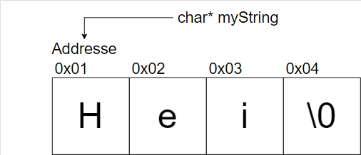

# Strings

## Strings i C

Dere er sikkert kjent med Strings som en datatype fra andre programmeringspråk. C har ingen datatype som "Strings" i for eksempel Java, eller i Python.

i C, så er en String definert som en array av char, som er **terminert** av en null-terminator. En null-terminator er en char med verdi i ASCII tabellen 0. Det vil si følgene symbol: '\0'.

Vi kan tegne en datastruktur-tegning for å gjøre det enklere å forstå dette konseptet.



Vi har en char\* peker, som peker på addressen 0x01. Vi kan indeksere inn i dette arrayet. Tar vi index 0 så får vi H, Tar vi index 1 så får vi e.

En ekstra kul ting, er at i C, så er strings _mutable_ mens i Java, så er det ikke slik. Vi kan modifisere strenger så mye vi vil. Vi får mer frihet, men vi må være mer forsiktige. Siden hvis vi gir en funksjon en _int_ stringLength og en _char[] myString_ og modifiserer dette et annen sted, må vi også oppdatere _int_ stringLength.

Vi kan lage arrayer på ulike måter.

```cpp

int main(void) {

    unsigned int myArrayLength = 10;
    char myArray[myArrayLength];

    char* myLiteral = "Heisann!";

    return 0

}
```

Vi har to eksempler over. `myArray` og `myLiteral`

Hva er forskjellen mellom de? Tenk på hva det betyr om de er _initialisert_ eller _ikke_

<details>
<summary>Hint</summary>
<br>

Når du skriver `char myArray[myArrayLength];` får du minne med en garanti at en null-terminator er der? Eller får du minne som kan potensielt inneholde rare verdier og søppel?

Hva med `char* myLiteral = "Heisann!";` Her så vet kompilatoren lengden, og innholdet. Får vi null-terminatoren, eller får vi søppel?

</details>

<details>
<summary>Svar</summary>
<br>

Først. Hva betyr "initialisering".

Initialisering betyr at minneområdet, fra starten av arrayet, til slutten settes til en verdi. Typisk verdien 0.

Det betyr at vi ikke får søppel-verdier som kan ligne der.

I tilfellet med `char myArray[myArrayLength];` så er det slik at det IKKE er initialisert. Vi får for eksempel tilfeldige tegn dersom vi prøver å printe denne.

I tilfellet med `char* myLiteral = "Heisann!";` så er det slik at det er initialisert. Her selve strengen 8 chars lang, og vi har en ekstra plass for null-terminatoren, som er 9 chars totalt.

</details>

## strlen og sizeof

La oss si at vi endrer myLiteral til å være "Hei!". Hva får vi når vi skriver strlen(myLiteral) sammenliknet med sizeof(myLiteral)?

<details>
<summary>Svar</summary>

strlen(char \*s) regner ut antall karakterer stringen som blir pekt på av s består av. Den tar ikke med nullbyten. Vi vil altså få 4, siden vi har fire karakterer.

sizeof blir brukt til å finne hvor mye minne som hele variabelen eller datatypen har i bytes. sizeof(char) vil gi 1, mens sizeof(myLiteral) vil gi 8. Det er fordi det er en charpeker, og pekere har 8 bytes.

</details>
