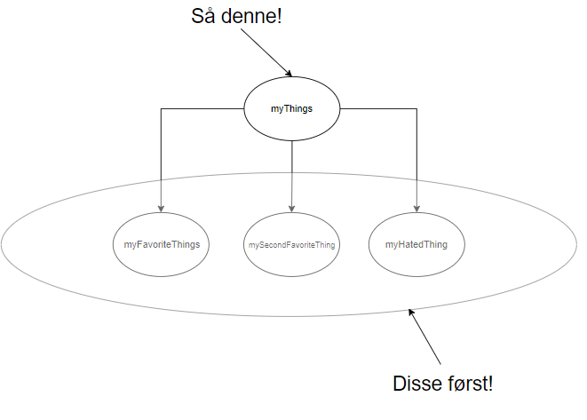

# Oppgave (Vanskelig)


Ukens oppgaver er delt i to ulike nivåer. Du er nå på den vanskelige oppgaven!


Oppgaven handler om å implementere en ```Vector``` for ```int```. Hvis du ikke er kjent med ```Vector``` så er det det samme som "ArrayList" fra Java. i C/C++ kaller vi ArrayLists for Vectors. Hvorfor? Vi vet faktisk ikke!

Tanken er at dere skal anvende ```structs``` til å implementere en veldig vanlig (og nyttig!) data-struktur.


### Krav-spesifikasjon

Du skal implementere en datastruktur som kan se slik ut. Det kan hende dere må bruke flere struct-members (Tenk instans-variabler, men ikke OOP!)

```cpp

struct Vector {

    int currentSize;
    int* elemArray;

}Vector;

```

Og som bør implementere følgene funksjoner. Det kan hende dere trenger flere hjelpe-funksjoner.

```cpp

int init_vector(Vector** myVec, int requestedSize);
void add_element(Vector** myVec, int element);
void remove_element(Vector** myVec, int deleteIdx);
void destroy_vector(Vector** myVec);


```

Skill ut funksjons-prototyper og struct definisjoner til en fil ```Vector.h``` og ha implementasjonen i ```Vector.c```

Funksjonen
```cpp
int init_vector(Vector** myVec, int requestedSize)
```

Tar i mot en dobbelt-peker. Funksjonen skal bruke **heap-allokering** for å sette av plass til en ```struct Vector```. Det skal være mulig å spesifisere en start størrelse. Hvis dette argumentet er ```null``` eller ```0``` så bør ```Vector``` struct ha en eller annen default-størrelse.

<details>
  <summary>Hint: Logikk</summary>
  Her må du skrive to cases for allokering. 

  Den ene hvor

  ```requestedSize != 0``` 
  
  og en annen hvor

  ```requestedSize == 0```

  Husk å sette verdiene riktig. Her kan det være nyttig å skrive default case, for å så utvide senere
</details>
<br>
<details>
  <summary>Hint Allokering</summary>

For allokering, må du gjøre beviste valg mellom 

```malloc``` 

og 

```calloc```

Her kan det være nyttig å bruke ```calloc``` for arrayet som faktisk holder elementene (men hvorfor? 🤔), mens ```malloc``` er bedre egnet for selve pekeren til structen.
  
</details>
<br>
<details>
  <summary>Hint: Returns</summary>
  Merk at funksjons-signaturen er int. Av og til i C bibloteker, så returner vi ikke en peker, men vi heller forventer en peker som aktuelle argumenter. Denne pekeren får verdien til addressen til structen.

<br>
  Return "int" blir av og til brukt for feilkoder. Her kan du bruke makroer til å definere ulike feil-koder som du kan returnere.
</details>
<br>
Funksjonen

```cpp
void add_element(Vector** myVec, int element)
```

Tar i mot et en peker til en peker til en *gyldig* ```Vector``` samt verdien som skal settes inn.

</details>
<br>
<details>
  <summary>Hint: Kapasitet</summary>

  Et problem er at vår ```Vector``` kan bli full. Det er et problem. Java sitt ArrayList har noe som heter *loadFactor*. Load-faktor er definert som OpptattStørrelse delt på TotalStørrelse. Hvis denne verdien er større enn 0.75, så dobler vi arrayet, og kopierer over elementene.

  Du må gjøre noe slikt. Her trenger du to hjelpefunksjoner.

  ```cpp
  void calculate_load_factor(Vector** myVec);
  ```

  og

  ```cpp
	void resize(Vector** myVec);
  ```

  hvor ```calculate_load_factor()``` beregner ```loadFactor``` som brukes til å bestemme *når* vi trenger å øke størrelsen, mens ```resize()``` faktisk øker størrelsen.

  i ```resize()``` kan du bruke calloc og memcpy for å effektivt lage et nytt array og kopiere over elemetene.


  ***Du kan også hoppe over dette steget, og heller få en ikke-dynamisk ArrayList***

</details>
<br>

Funksjonen

```cpp
void remove_element(Vector** myVec, int deleteIdx)
```

Skal ta i mot en peker til en peker til en gyldig ```Vector``` 
samt en ```int deleteIdx``` som er indeksen til element som skal slettes.


</details>
<br>
<details>
  <summary>Hint: Hull</summary>

Et problem som kan skje, er *hull* i arrayet. Dette er rett og slett at etter at vi sletter, så har vi en tom plass, som kan brukes, men gjør innsetningslogikken litt vanskligere (f.eks man må holde en liste over hull, og hvis den er tom, så kan vi sette inn fra slutten)

Når du sletter et element, så er det mulig å flytte alle elementer til venstre en plass. Dette "bobler" opp hullet til slutten av arrayet. Du trenger en hjelpe-funksjon som kanskje har signaturen:

```cpp
shift_left(Vector** myVec, int idx)
```

Som flytter alle elementer **etter** hullet en plass til venstre. Dette kan virke ueffektivt, og det er det. Dette er noen av trade-offs til en Array-backed ArrayList med O(ArraySize) deletion versus en LinkedList som tilbyr O(1) deletion. (KUN: hvis vi har peker til node vi ønsker å slette!)

</details>
<br>
Funksjonen


```cpp
void destroy_vector(Vector** myVec)
```

Skal ta i mot en peker til en peker til en gyldig ```Vector```. Den skal frigjøre alle heap-allokeringer som structen har brukt. Grunnen til at dette er en funksjon, er at det er ikke programmet som bruker structen sin oppgave i å frigjøre manuelt, men heller en funksjon som gjør det på en riktig, og i riktig rekkefølge!

<details>
  <summary>Hint: free()</summary>

Riktig bruk av ```free()``` er avhengig av to faktorer. Du må frigjøre riktig ting (altså noe som er gitt av ```malloc/calloc/realloc```) og til riktig tid! Du kan ikke frigjøre noe som er heap-allokert, som i seg selv inneholder en peker som er heap-allokert. Dette er en minne feil. Du må frigjøre. Ta denne structen som et eksempel. Anta at alle pekere er malloc'd


```cpp
	struct myThings {

		char* myFavoriteThing;
		char* mySecondFavoriteThing;
		char* myHatedThing;
	}

	struct myThings instanceThings = malloc(sizeof(struct myThings))
```

Her kan vi ikke begynne med ```free(struct myThings)```, siden dette vil frigjøre pekeren til struct-medlemene, hvis vi fortsatt akkseserer tingene, vil vi få en minne-feil. I stedet må vi frigjøre alle tre pekere inni, i frivillig rekkefølge (så lenge de ikke har barn!) og derreter frigjøre foreldre-pekeren.



Bildet bør forklare hva vi mener på en intuitiv måte.


Husk også. Vi ```free()``` aldri samme peker. Det finnes også funksjoner som heap-allokerer, men som ```free()``` ikke aksepterer. Disse vil du ikke få bruk for i dette kurset, som f.eks ```kmalloc``` og ```kfree()```. Husk igjen at noen funksjoner allokerer, så les alltid man-sidene for å vite hva en funksjon faktisk gjør!


</details>


<br>
Hvis du har kommet helt ned hit, så har du greid det; håper vi. Du får nyte deg med en virtuell kake: 🎂

Noe som er anbefalt, men som vi ikke kommer til å gå gjennom er hvordan vi implementerer ```generics``` i C. Før dere blir sure, så er det ikke sanne generics. C er ikke objekt-orientert, men vi kan gjøre noen veldig kule ting med makroer + slike data-strukturer. Dere kan lese gjennom: https://rebelsky.cs.grinnell.edu/musings/cnix-macros-generics#reference12 hvis dere føler dere stødige på dette.

Dere trenger ikke å kunne mer makroer enn #define for dette kurset.
