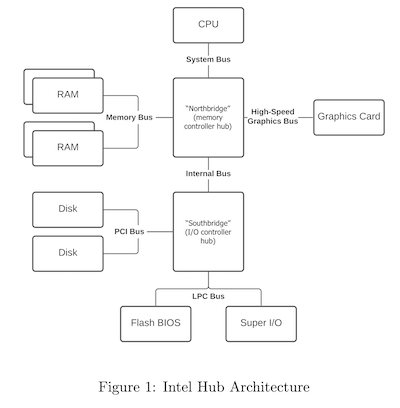

Forståelsesspørsmål 1: Introduksjon til kurset
----------------------------------------------

### Norsk

 Tenk på den (forenklede) Intel Hub-arkitekturen som er vist i figur 1. Et program som kjører på et generelt operativsystem ber om en enkel datablokk, som ikke finnes i prosessoren og som må hentes fra disken. Etter vellykket gjennomføring av forespørselen:
 

* Hvor mange ganger har dataene gått over den interne bussen?
* Og hvor mange ganger over minnebussen?
* Hvis mer enn en gang (i noen av de ovennevnte tilfellene): Av hvilken grunn? Åpenbart fører dette til ytelsesoverhead. Hva er avveiningene?

### English

Consider the (simplified) Intel Hub Architecture shown in Figure 1. An application, running on a generic operating system, requests a single unit of data, which is not found in the CPU and it must be fetched from disk. Upon successful completion of the request:

* How many times have the data passed over the internal bus?
* And how many times over the memory bus?
* If more than once (in any of the above cases): For what reason? Obviously, this infers performance overhead. What is the trade-off?

