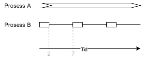
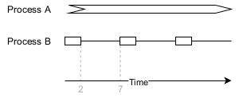

# CPU og skedulering

## (1) Funksjonskall vs systemkall

### Norsk

Systemkallet `read()` forsøker å lese count bytes inn i bufferen pekt på av `buf` fra filen tilknyttet den åpne filendeskriptoren `fd`. Ved suksess returnerer den antall leste bytes. Ved feil returnerer den negativ én.

```
ssize_t read(int fd, void *buf, size_t count);
```

Som nesten alle systemkall i Linux, aktiveres `read()` gjennom en bibliotekfunksjon med samme navn. Det finnes også andre bibliotekfunksjoner som er avhengige av `read()`. Hvis dette virker forvirrende, les man-sidene `man 2 read` (systemkall) og `man 3 read` (biblioteksfunksjon).

```
ssize_t read(int fildes, void *buf, size_t nbyte);
```

Systemkall fungerer som inngangspunkter til kjernen, hvor selve «tungløftingen» av for eksempel lesing av bytes fra en fil lagret på disken inn i RAM utføres. Kjernefunksjonen som tilsvarer `read()` er `sys_read()`.

* Hvis man ser bort fra forkunnskaper, finnes det noen generell måte å avgjøre om en signatur tilhører et systemkall eller en bibliotekfunksjon?
* Uansett hvordan det kan se ut på overflaten fungerer funksjonskall og systemkall forskjellig internt. Systemkall utsteder `TRAP`-instruksjonen for å gå inn i kjernen, mens funksjonskall utsteder `CALL`-instruksjonen for å kalle en annen funksjon. På hvilke to grunnleggende måter er oppførselen til disse instruksjonene forskjellig?
* Kjernefunksjoner pakket inn i systemanrop pakket inne i bibliotekfunksjoner… Hvorfor ikke spare bryderiet og kalle `sys_read()` direkte fra programmet? Er det mulig? I så fall, eller hvis det var det, ville stress spart virkelig vært større enn stress skapt?

### English

The `read()` system call attempts to read count bytes into the buffer pointed to by `buf` from the file associated with the open file descriptor `fd`. On success, it returns the number of bytes read. On failure, it returns negative one.

```
ssize_t read(int fd, void *buf, size_t count);
```

As almost all system calls in Linux, `read()` is invoked through a library function with the same name. There are also other library functions that rely on `read()`. If this seems confusing, read the man pages `man 2 read` (system call) and `man 3 read` (library function).

`ssize_t read(int fildes, void *buf, size_t nbyte);`

System calls serve as entry points into the kernel, where the actual “heavy lifting” of, for example, reading bytes from a file stored on disk into RAM is performed. The kernel function corresponding to `read()` is `sys_read()`.

* Disregarding prior knowledge, is there any general way of telling whether a signature belongs to a system call or a library function?
* However it may seem on the surface, function calls and system calls have different internal workings. System calls issue the `TRAP` instruction to enter the kernel, whereas function calls issue the `CALL` instruction to call another function. In what two fundamental ways does the behavior of these instructions differ?
* Kernel functions wrapped inside system calls wrapped inside library functions… Why not save the hassle and call `sys_read()` directly from the program? Is it possible? If so, or if it were, would hassle saved really be greater than hassle created?

## (2) Shortest Job First

### Norsk

For ulike typer datamaskiner og forventet arbeidsmengde vil vi bruke skeduleringsalgoritmer med svært forskjellige egenskaper. Vennligst vurder følgende spørsmål.

* Beskriv hvordan en shortest job first (SJF)-skedulerer fungerer. Hva er fordelen med SJF-skedulering?
* Hvorfor brukes ikke SJF-skedulering som den primære skeduleringsstrategien for stasjonære datamaskiner som brukes interaktivt for typisk kontorarbeid?
* Du administrerer en server som er ment for stor, beregningstung arbeidslast uten interaktivitet. Forklar hva slags scheduleringsalgoritme du bruker på denne serveren og hvorfor.

### English

For different kinds of computers and expected workload, we will use scheduling algorithms with very different properties. Please consider the following questions.

* Describe how a shortest job first (SJF) scheduler works. What is the advantage of SJF scheduling?
* Why is SJF scheduling not used as the main scheduling strategy for desktop computers that are used interactively for typical office workloads?
* You manage a server that is meant for large, computation-heavy workloads without interactivity. Explain the kind of scheduling algorithm that you use on this server and why.

## (3) Round Robin

### Norsk

Interaktive programmer krever en form for preemtiv skedulerer for å tilby god ytelse. Som et hobbyprosjekt jobber du med et operativsystem for arbeidsstasjoner. For å gjøre det enkelt har du valgt skeduleringsalgoritmen Round Robin. Figur 2 viser utbruddsmønstrene for to typiske prosesser som kan kjøre på systemet: én CPU-bunden og én I/O-bunden. Tiden mellom utbruddene brukes på diskoperasjoner.



*Figur 2: Utbruddsmønstre for to prosesser på en arbeidsstasjon*

* Hvordan vil lengden på tidsintervallet påvirke diskutnyttelse? Vurder intervaller på henholdsvis 50 ms og 1 ms. Det later til at kortere intervaller sørger for bedre diskutnyttelse. Hvorfor ikke gjøre intervallene så korte som mulig?
* Hvilke andre mål bør veies mot maksimal diskutnyttelse når man velger skeduleringsalgoritme for et slikt operativsystem?

### English

Interactive programs require some kind of preemptive scheduler to yield good performance. As a hobby project, you work on an operating system for workstations. To keep things simple, you have chosen the Round Robin scheduling algorithm. Figure 2 shows the burst patterns for two typical processes that may run on the system: one CPU-bound and one I/O-bound. The time between bursts is spent on disk operations.



*Figure 2: Burst patterns for two processes on a workstation*

* How does timeslice length affect disk utilization? Consider timeslices of 50 ms and 1 ms, respectively.
* It seems that shorter timeslices makes for better disk utilization. Why not make timeslices as short as possible?
* What other goals should be weighed against maximizing disk utilization when choosing the scheduling algorithm for such an operating system?
