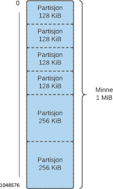
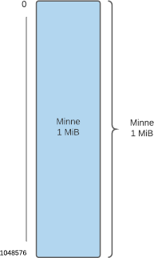
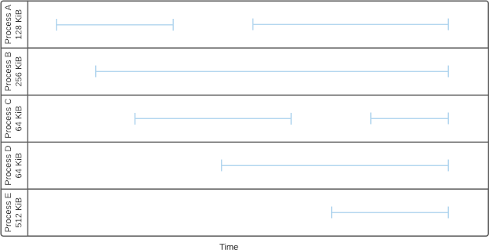
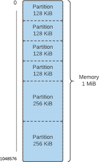
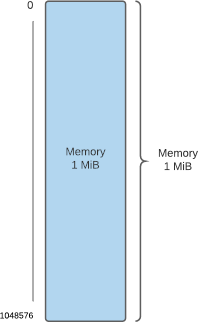
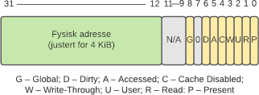
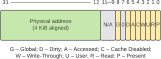

# Minne

## (1) Layout

### Norsk

De fleste moderne operativsystemer utruster prosesser med privat og
partisjonert minne. Dette sikrer at prosesser ikke forstyrrer hverandres
data; det holder også forskjellige typer data atskilt i hver prosess.
Segmentene er vanligvis navngitt som følger, med antydning til bruken:
systemdatasegmentet (også kjent som prosesskontrollblokken (PCB)),
kodesegmentet (eller tekstsegmentet), det initialiserte datasegmentet
(eller bare datasegmentet), det uinitialiserte datasegment (også kjent
som BSS-segmentet), heapen og stakken.

1.  Vanligvis er et program først lagret på disk, hvorfra det bringes
    inn i minnet. Vil du argumentere for at kodesegmentet inneholder
    (deler av) programmet eller prosessen – eller begge to?
2.  Heapen og stakken vokser mot hverandre og motsatte ender av
    adresserommet (ettersom data lagres til dem). Hva er hensikten med
    denne ordningen? Hva skjer hvis rommet mellom dem blir oppbrukt?
3.  Heapen og stakken inneholder begge prosessens kjøretidsdata. Å velge
    hvilken som bør brukes når er ikke alltid åpenbart
    for programmereren. Hvordan drar en prosess nytte av disse to
    minnestrukturer? Ville bare én være tilstrekkelig?

### English

Most modern operating systems provide processes with private and
partitioned memory. This ensures that processes do not interfere with
each other´s data; it also keeps different kinds of data separate within
each process. The segments are typically named as follows, which hints
at their use: the system data segment (also known as the process control
block (PCB)), the code (or text) segment, the initialized data (or just
data) segment, the uninitialized data segment (also known as the BSS
segment), the heap, and the stack.

1.  Typically, a program is first stored on disk, from where it is brought
    into memory. Would you argue that the code segment contains (parts
    of) the program or the process or both?
2.  The heap and the stack grow towards each other and opposite ends of
    the address space (as data are stored to them). What is the purpose
    of this arrangement? What happens if the space between them is
    exhausted?
3.  The heap and the stack both contain process runtime data. The choice
    of when to use which is not always obvious to the programmer. How
    does a process benefit from these two memory structures?
    Would only one suffice?

## (2) Partisjonering

### Norsk

Figur 1: Kjøretidsplan

Fem programmer kjører på et meget lite system, som en værstasjon til
hjemmebruk, med beskjedne 1 MiB minne. Når Program A eksekveres, kjører
det i en prosess som tar opp 128 KiB. For enkelhets skyld kaller vi det
Prosess A hver gang det kjører. Når Prorgam B eksekveres, tar dets
prosess opp 256 KiB. Prosesser for C og D tar opp 64 KiB. Prosesser for
E tar opp 512 KiB. Figur 1 viser kjøretidsplanen.

Figur 2: Statisk partisjonering

Det finnes flere metoder for å tildele prosesser minne. Dette er en
viktig del av minnehåndteringen. Tre slike metoder behandles her:
statisk partisjonering (med partisjoner av ulik størrelse), dynamisk
partisjonering og *buddy*-tildeling. Segmentering anvendes ikke; én
prosess må få plass innenfor én partisjon.

Figur 3: Dynamic partisjonering

1.  Ta i betraktning den statiske partisjoneringsplanen vist i Figur 2.
    Hvordan er prosessene plassert i minnet like før slutten? Hva skjer
    med Proses E? Hva slags og hvor mye fragmentering forekommer?
2.  Figur 3 viser minnelayouten uten forhåndsbestemte partisjoner. Dette
    støtter *dynamisk* partisjonering. Hvordan er resultatet annerledes
    når dynamisk partisjonering brukes med hver av tildelingsalgoritmene
    *First Fit*, *Next Fit* og *Best Fit*? Hvilken mekanisme kan hjelpe
    Prosess E? Når man velger en tildelingsalgoritme, hvilke andre
    kriterier – foruten fragmentering – er verdt å ta i betraktning?
3.  *Buddy*-tildeling henter inspirasjon fra både statisk og dynamisk
    partisjonering – som en hybrid mellom dem. Hvilket resultat gir
    *buddy*-tildeling?

### English

Figur 1: Runtime Schedule

Five programs run on a very small system, like a home weather station,
with a modest 1 MiB of memory. When Program A is executed, it runs in a
process that occupies 128 KiB. For simplicity, we call it Process A
every time it runs. When Program B is executed, its process occupies 256
KiB. Processes for C and D occupy 64 KiB. Processes for E occupy 512
KiB. Figure 1 shows the runtime schedule.

Figure 2: Static Partitioning

There are several methods to allocate memory to processes. This is an
important part of memory management. Three such methods are considered
here: static partitioning (with unequal-size partitions), dynamic
partitioning, and buddy allocation. Segmentation is not applied; one
process must fit inside one partition.

Figure 3: Dynamic Partitioning

1.  Consider the static partitioning scheme shown in Figure 2. How are
    the processes placed in memory shortly before the end? What happens
    to Process E? What kind of and how much fragmentation is there?
2.  Figure 3 shows the memory layout without predetermined partitions.
    This is conducive to dynamic partitioning. How is the result
    different when dynamic partitioning is used with each of the
    allocation algorithms First Fit, Next Fit, and Best Fit? What
    mechanism can help Process E? When choosing the allocation
    algorithm, what other performance indicators—apart from the amount
    of fragmentation—are worth considering?
3.  Buddy allocation draws on both static and dynamic partitioning—like
    a hybrid between the two. What result does buddy allocation yield?

## (3) Multilevel Paging

### Norsk

Som teknikk løser virtuelt minne visse problemer, men introduserer også
noen nye. Et abstraksjonslag legges over fysisk minne, slik at
applikasjoner (eller snarere de som skriver dem) ikke behøver å bry seg
med de rent fysiske detaljene ved minnehåndtering; operativsystemet gjør
den tunge jobben i så måte. Sidetabellen, som knytter virtuelle adresser
til fysiske adresser, brukes for å utføre denne funksjonen. Den bærer
likevel med seg en viss kostnad i form av tid og rom: Sidetabellen må
nødvendigvis lagres noensteds, mens sidetabelloppslag forbruker
CPU-sykler.

Figur 1: Sidetabelloppføring
1.  En sidetabelloppføring på IA-32-arkitekturen er vist i Figur 1. Gitt
    at sidestørrelsen er 4 KiB, hvor stor er sidetabellen? (Husk at
    antall sider kan utledes fra sidestørrelsen.)
2.  Hvis det viser seg at sidetabellen ikke er overdrevent stor, hvorfor
    ikke lagre alt dets innhold i minnet til enhver tid? Med andre ord:
    Hvorfor bry seg med *multilevel paging* i utgangspunktet? Hvis det
    behøves, kan ikke sidetabellen simpelthen swappes ut til disk?
3.  Forandrer multilevel paging situasjonen når det gjelder å swappe ut
    sidetabellen? Hvordan i så fall?

### English

As a technique, virtual memory solves some problems, but it also
introduces some new ones. An abstraction layer is addded on top of
physical memory so that applications (or rather those who write them)
need not worry about the nuts and bolts of memory management; the OS
does the heavy lifting in that regard. The page table, which maps
virtual addresses to physical addresses, is used to perform this
function. However, it comes with a certain cost in terms of time and
space: the page table obviously has to be stored somewhere, while page
table lookups consume CPU cycles.

Figure 1: Page Table Entry
1.  A page table entry on the IA-32 architecture is shown in Figure 1.
    Given that the page size is 4 KiB, how large is the page table?
    (Remember that the number of pages is deducible from the page size.)
2.  If it turns out that the page table is not overly large, why not
    keep all of its contents in memory at all times? In other words, why
    even bother with multilevel paging? And if need be, can the page
    table not just be swapped out to disk?
3.  Does multilevel paging change the situation with regard to swapping
    out the page table? If so, how?

